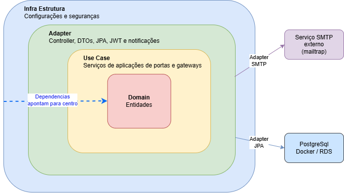
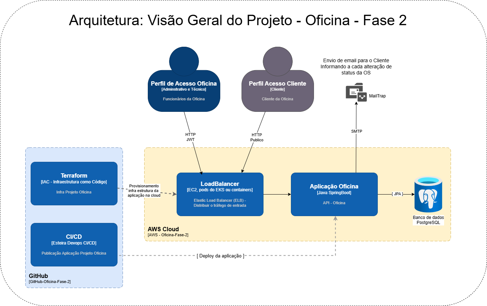

# Oficina Backend — Sistema de Gestão de Oficina Mecânica

[](https://github.com/tiagomiele/fiap-tech-challenge-oficina-mecanica-fase2/actions/workflows/ci.yml)

Back-end para gestão de uma oficina mecânica de médio porte — Tech Challenge SOAT / FIAP — Java 21, Spring Boot 3.3, PoolhreSQL 16, Clean Architecture, DDD, Docker, Kubernetes, GitHub Actions, Terraform e AWS.

Este documento apresenta o projeto e funciona como roteiro reproduzível de validação. Todos os comandos foram escritos para **Windows PowerShell**. A sequência incorpora as causas raiz e correções confirmadas durante a execução real de Maven, Docker Desktop, Docker Compose, Minikube, metrics-server e HPA.

---

## Sumário

- [1. Sobre o projeto](#1-sobre-o-projeto)
- [2. Objetivos da Fase 2](#2-objetivos-da-fase-2)
- [3. Funcionalidades](#3-funcionalidades)
- [4. Arquitetura](#4-arquitetura)
- [5. Tecnologias e pré-requisitos](#5-tecnologias-e-pré-requisitos)
- [6. Ordem recomendada da validação](#6-ordem-recomendada-da-validação)
- [7. Preparar o projeto](#7-preparar-o-projeto)
- [8. Validar código, testes e arquitetura](#8-validar-código-testes-e-arquitetura)
- [9. Executar localmente com Docker Compose](#9-executar-localmente-com-docker-compose)
- [10. Validar o fluxo funcional da API](#10-validar-o-fluxo-funcional-da-api)
- [11. Executar localmente com Minikube](#11-executar-localmente-com-minikube)
- [12. Validar escalabilidade com HPA no Minikube](#12-validar-escalabilidade-com-hpa-no-minikube)
- [13. Publicar a feature e validar o CI](#13-publicar-a-feature-e-validar-o-ci)
- [14. Validar o CD e a imagem no GHCR](#14-validar-o-cd-e-a-imagem-no-ghcr)
- [15. Provisionar a AWS com Terraform Cloud](#15-provisionar-a-aws-com-terraform-cloud)
- [16. Implantar e validar a aplicação no EKS](#16-implantar-e-validar-a-aplicação-no-eks)
- [17. Validar o HPA no EKS](#17-validar-o-hpa-no-eks)
- [18. Encerrar os recursos da AWS](#18-encerrar-os-recursos-da-aws)
- [19. Endpoints principais](#19-endpoints-principais)
- [20. Variáveis de ambiente](#20-variáveis-de-ambiente)
- [21. Troubleshooting](#21-troubleshooting)
- [22. Evidências para a entrega](#22-evidências-para-a-entrega)
- [23. Documentação adicional](#23-documentação-adicional)

---

## 1. Sobre o projeto

O sistema controla o ciclo completo de uma Ordem de Serviço, desde o recebimento do veículo até o pagamento e a entrega. O processo inclui diagnóstico, orçamento, aprovação do cliente, consumo de peças, execução do reparo, movimentações financeiras e notificações.

O projeto aplica Domain-Driven Design e Clean Architecture. As regras de negócio permanecem isoladas de banco de dados, framework web e infraestrutura.

### O que o sistema oferece

- cadastro de clientes e veículos;
- catálogo de serviços e peças;
- controle de estoque e movimentações;
- notas fiscais de fornecedor;
- ciclo completo de Ordens de Serviço;
- múltiplos orçamentos por OS;
- contas a pagar e a receber;
- relatórios administrativos;
- consulta pública do status da OS;
- notificação por log ou SMTP;
- autenticação JWT e controle de perfis;
- execução em Docker e Kubernetes;
- escalabilidade por CPU e memória;
- infraestrutura AWS criada por Terraform;
- CI/CD com GitHub Actions e GHCR.

---

## 2. Objetivos da Fase 2

| Objetivo | Implementação |
|---|---|
| Melhorar organização e manutenibilidade | Clean Architecture com quatro anéis e regras validadas por ArchUnit |
| Automatizar qualidade | GitHub Actions, 120 testes, JaCoCo, SBOM CycloneDX e Trivy |
| Padronizar execução | Docker, Docker Compose e manifestos Kubernetes |
| Suportar aumento de carga | HPA com 2–5 pods, CPU alvo de 70% e memória alvo de 80% |
| Automatizar infraestrutura | Terraform Cloud provisionando VPC, EKS e RDS na AWS |
| Automatizar entrega | Build e publicação da imagem no GHCR, promoção por ambiente e aprovação de produção |

---

## 3. Funcionalidades

### Clientes e veículos

- validação de CPF/CNPJ;
- placas no formato antigo e Mercosul;
- vínculo entre veículo e cliente;
- bloqueio de operações que violem as regras de negócio.

### Ordens de Serviço

- abertura de OS em `RECEBIDA`;
- abertura unificada com itens;
- diagnóstico e orçamento;
- adição de serviços e peças;
- aprovação, rejeição e novo orçamento;
- execução, pagamento e entrega;
- cancelamento durante diagnóstico;
- alteração administrativa de status com validação;
- relatório por prioridade e data;
- exclusão de `PAGA`, `ENTREGUE` e `CANCELADA` da listagem ativa.

### Estoque e suprimentos

- estoque nunca negativo;
- entrada por nota fiscal;
- consumo por orçamento;
- devolução em rejeição ou cancelamento;
- rastreabilidade das movimentações.

### Financeiro

- conta a pagar gerada por nota fiscal;
- conta a receber gerada no pagamento da OS;
- suporte a estorno.

### Segurança

- autenticação JWT;
- senhas BCrypt;
- perfis `FUNCIONARIO_DA_OFICINA` e `TECNICO_DA_OFICINA`;
- consulta pública do status da OS.

---

## 4. Arquitetura

### Clean Architecture — quatro anéis

```text
Infrastructure
└── Adapter
    └── Usecase
        └── Domain
```

- **Domain:** entidades, value objects, enums e exceções de negócio em Java puro.
- **Usecase:** serviços de aplicação e interfaces de gateways/repositórios.
- **Adapter:** controllers, DTOs, persistência JPA, JWT e notificações.
- **Infrastructure:** configurações Spring, segurança, OpenAPI e composição da aplicação.

As dependências apontam para dentro. O domínio não depende de Spring, JPA, Servlet ou infraestrutura.



### Infraestrutura AWS

A infraestrutura utiliza:

- VPC com subnets públicas e privadas em duas zonas de disponibilidade;
- Internet Gateway e NAT Gateway;
- EKS Kubernetes 1.31;
- node group `t3.medium`, desejado 2, mínimo 1 e máximo 3 nodes;
- RDS PostgreSQL 16 `db.t3.micro`;
- LoadBalancer para expor a aplicação;
- GHCR para armazenar a imagem Docker;
- HPA com 2–5 pods.



## 5. Tecnologias e pré-requisitos

### Tecnologias

| Área | Tecnologia |
|---|---|
| Linguagem | Java 21 |
| Framework | Spring Boot 3.3.4 |
| Build | Maven Wrapper |
| Banco | PostgreSQL 16 |
| Persistência | Spring Data JPA, Hibernate e Flyway |
| Segurança | Spring Security, JWT e BCrypt |
| Testes | JUnit 5, Mockito, AssertJ, ArchUnit, Testcontainers 1.21.4+ e RestAssured |
| Cobertura | JaCoCo |
| Containers | Docker e Docker Compose |
| Orquestração | Kubernetes 1.31 e HPA `autoscaling/v2` |
| CI/CD | GitHub Actions e GHCR |
| IaC | Terraform e HCP Terraform/Terraform Cloud |
| Cloud | AWS VPC, EKS, EC2, RDS e LoadBalancer |

### Programas necessários

Instale e confirme no PowerShell:

```powershell
git --version
docker --version
docker compose version
java -version
minikube version
kubectl version --client
terraform version
aws --version
```

Requisitos recomendados:

- Windows 11 e PowerShell 5.1 ou 7;
- Docker Desktop em execução, usando containers Linux;
- Docker Engine 29 somente com Testcontainers 1.21.4 ou superior;
- Java 21;
- Minikube;
- `kubectl` 1.31 ou uso de `minikube kubectl --` para evitar incompatibilidade com o cluster;
- Terraform 1.5 ou superior;
- AWS CLI;
- conta no GitHub;
- conta no HCP Terraform;
- sessão ativa no AWS Academy apenas durante a etapa AWS.

### Segurança

Nunca publique ou grave em vídeo:

- `AWS_ACCESS_KEY_ID`;
- `AWS_SECRET_ACCESS_KEY`;
- `AWS_SESSION_TOKEN`;
- senha do RDS;
- token do HCP Terraform;
- credenciais SMTP;
- conteúdo de Secrets Kubernetes.

Credenciais do AWS Academy expiram quando o laboratório termina. Sempre use as três credenciais da mesma sessão.

---

## 6. Ordem recomendada da validação

Execute nesta ordem:

1. clonar e conferir o projeto;
2. executar os 120 testes e a validação arquitetural;
3. validar Docker Compose;
4. validar o fluxo funcional da API;
5. validar Minikube;
6. validar HPA localmente;
7. publicar a branch `feature/*` e abrir o Pull Request;
8. validar o CI;
9. validar o build e a publicação da imagem pelo CD;
10. criar/configurar o workspace do Terraform Cloud;
11. provisionar VPC, EKS e RDS;
12. implantar a imagem publicada no EKS;
13. validar aplicação e HPA na AWS;
14. coletar evidências;
15. destruir a infraestrutura e encerrar o laboratório.

O HPA aparece primeiro nos testes locais porque o Minikube permite validar escalabilidade sem consumir créditos AWS. No EKS é feita uma confirmação final.

---

## 7. Preparar o projeto

### Clonar o repositório

```powershell
git clone https://github.com/tiagomiele/fiap-tech-challenge-oficina-mecanica-fase2.git
Set-Location .\fiap-tech-challenge-oficina-mecanica-fase2
```

### Conferir repositório e branch

```powershell
git remote -v
git branch --show-current
git status
```

Para apenas reproduzir o projeto entregue, use a `main`:

```powershell
git checkout main
git pull origin main
```

Para simular o ciclo de desenvolvimento, use uma branch que corresponda ao padrão do CD:

```powershell
git checkout -b feature/validacao-entrega
```

O padrão precisa começar com `feature/`. Nomes como `featurevalidacao` não acionam o estágio de staging definido em `cd.yml`.

---

## 8. Validar código, testes e arquitetura

### Objetivo

Esta etapa compila o projeto, inicia um PostgreSQL descartável com Testcontainers, executa testes unitários, arquiteturais e de integração, verifica a cobertura JaCoCo, gera o JAR e produz o SBOM CycloneDX. O Docker Desktop precisa estar acessível antes do Maven.

### Confirmar a compatibilidade do Testcontainers

Docker Engine 29 rejeita a API antiga usada pelo Testcontainers 1.20.2. O projeto deve usar 1.21.4 ou superior:

```powershell
Select-String `
  -Path .\pom.xml `
  -Pattern '<testcontainers.version>'
```

Resultado esperado:

```xml
<testcontainers.version>1.21.4</testcontainers.version>
```

### Restaurar o Docker Desktop antes dos testes

Se esta janela já foi usada com `minikube docker-env`, remova o redirecionamento antes de executar o Maven:

```powershell
Remove-Item Env:DOCKER_HOST -ErrorAction SilentlyContinue
Remove-Item Env:DOCKER_TLS_VERIFY -ErrorAction SilentlyContinue
Remove-Item Env:DOCKER_CERT_PATH -ErrorAction SilentlyContinue
Remove-Item Env:MINIKUBE_ACTIVE_DOCKERD -ErrorAction SilentlyContinue

docker context use desktop-linux
docker version
docker info --format '{{.Name}}'
```

`docker version` deve mostrar **Client** e **Server**. O nome esperado é `docker-desktop`.

> Se aparecer `Could not find a valid Docker environment`, não altere nem desative testes. Primeiro corrija o Docker Desktop ou a compatibilidade do Testcontainers.

### Executar o build completo

```powershell
.\mvnw.cmd clean verify
```

Resultado esperado:

```text
Tests run: 120, Failures: 0, Errors: 0, Skipped: 0
All coverage checks have been met.
BUILD SUCCESS
```

O comando valida:

- compilação de produção e testes;
- testes unitários;
- testes de integração com PostgreSQL/Testcontainers;
- cinco regras ArchUnit;
- cobertura JaCoCo;
- gate mínimo de cobertura no domínio;
- geração do JAR executável;
- SBOM CycloneDX em XML e JSON.

O aviso de artefato CycloneDX já anexado pode aparecer quando o plugin executa em mais de uma fase. Ele não representa falha quando o build termina em `BUILD SUCCESS`.

### Conferir os artefatos

```powershell
Get-ChildItem .\target\surefire-reports\*.txt |
  Select-String "Tests run:"

Get-Item .\target\oficina-backend.jar
Get-Item .\target\bom.xml
Get-Item .\target\bom.json
Start-Process .\target\site\jacoco\index.html
```

### Regras ArchUnit

Os testes em `src/test/java/br/com/oficina/architecture/ArchitectureTest.java` garantem:

1. dependências entre os quatro anéis;
2. domínio sem Spring;
3. domínio sem JPA/Hibernate;
4. usecases sem dependência de adapters/infrastructure;
5. adapters sem dependência de infrastructure.

---

## 9. Executar localmente com Docker Compose

### Objetivo

O Docker Compose cria PostgreSQL, aplicação e Adminer no Docker Desktop. Essa etapa valida o Dockerfile, as migrações Flyway, a conexão com o banco, o health check e a API antes do Kubernetes.

### Garantir o contexto correto

```powershell
Remove-Item Env:DOCKER_HOST -ErrorAction SilentlyContinue
Remove-Item Env:DOCKER_TLS_VERIFY -ErrorAction SilentlyContinue
Remove-Item Env:DOCKER_CERT_PATH -ErrorAction SilentlyContinue
Remove-Item Env:MINIKUBE_ACTIVE_DOCKERD -ErrorAction SilentlyContinue

docker context use desktop-linux
docker version
```

### Preparar uma execução limpa

Preservar o volume existente:

```powershell
docker compose down --remove-orphans
```

Para apagar também o banco local e repetir tudo do zero:

```powershell
docker compose down -v --remove-orphans
```

### Subir os serviços

```powershell
docker compose up --build -d
docker compose ps
```

Resultado esperado:

- `oficina-db` em execução e saudável;
- `oficina-app` em execução;
- `oficina-adminer` em execução.

### Aguardar a aplicação ficar pronta

```powershell
$Health = $null

for ($Tentativa = 1; $Tentativa -le 36; $Tentativa++) {
  try {
    $Health = Invoke-RestMethod `
      -Uri 'http://localhost:8080/actuator/health' `
      -TimeoutSec 5

    if ($Health.status -eq 'UP') {
      break
    }
  }
  catch {
    Start-Sleep -Seconds 5
  }
}

if ($null -eq $Health -or $Health.status -ne 'UP') {
  docker compose ps
  docker compose logs --tail=150 app
  docker compose logs --tail=100 db
  throw 'A aplicação não ficou saudável no tempo esperado.'
}

$Health
Test-NetConnection localhost -Port 8080
```

Resultado esperado: `status = UP` e `TcpTestSucceeded = True`.

Se `Invoke-RestMethod` responder `Impossível conectar-se ao servidor remoto`, a aplicação ainda não iniciou. Não é erro de login ou JWT.

### Consultar logs sem parar os containers

```powershell
docker compose logs --tail=100 app
docker compose logs --tail=100 db
```

Para acompanhar continuamente:

```powershell
docker compose logs -f app
```

Use `Ctrl+C` para sair dos logs sem parar os serviços.

### Abrir Swagger e Adminer

```powershell
Start-Process http://localhost:8080/swagger-ui/index.html
Start-Process http://localhost:8081
```

Adminer:

| Campo | Valor local |
|---|---|
| Sistema | PostgreSQL |
| Servidor | `db` |
| Usuário | `oficina` |
| Senha | `oficina` |
| Base | `oficina` |

### Manter os serviços para o fluxo funcional

Não encerre o Compose antes do tópico 10. O login e os demais comandos da API dependem da aplicação escutando em `localhost:8080`.

Ao terminar o tópico 10, encerre os containers antes do Minikube para liberar memória e portas:

```powershell
docker compose down
```

Não use `-v` nesse momento se quiser preservar o banco local.

---

## 10. Validar o fluxo funcional da API

O bloco abaixo executa o fluxo principal de uma OS. Use-o com Docker Compose, Minikube ou EKS alterando apenas `$BaseUrl`.

Para uma base limpa, execute primeiro `docker compose down -v` e suba novamente os containers.

### Definir URL e autenticar

```powershell
$BaseUrl = "http://localhost:8080"

$Login = Invoke-RestMethod `
  -Method Post `
  -Uri "$BaseUrl/auth/login" `
  -ContentType "application/json" `
  -Body (@{
    email = "admin@oficina.local"
    senha = "admin123"
  } | ConvertTo-Json)

$Token = $Login.accessToken
$Headers = @{ Authorization = "Bearer $Token" }

$Login | Format-List
```

### Cadastrar cliente

```powershell
$Cliente = Invoke-RestMethod `
  -Method Post `
  -Uri "$BaseUrl/clientes" `
  -Headers $Headers `
  -ContentType "application/json" `
  -Body (@{
    nome = "Joao Teste"
    documento = "52998224725"
    email = "joao.teste@example.com"
    telefone = "11999999999"
  } | ConvertTo-Json)

$IdCliente = $Cliente.idCliente
$Cliente
```

### Cadastrar veículo

```powershell
$Veiculo = Invoke-RestMethod `
  -Method Post `
  -Uri "$BaseUrl/veiculos" `
  -Headers $Headers `
  -ContentType "application/json" `
  -Body (@{
    placa = "ABC1234"
    marca = "Fiat"
    modelo = "Uno"
    ano = 2020
    idCliente = $IdCliente
  } | ConvertTo-Json)

$Veiculo
```

### Cadastrar serviço

```powershell
$Servico = Invoke-RestMethod `
  -Method Post `
  -Uri "$BaseUrl/servicos" `
  -Headers $Headers `
  -ContentType "application/json" `
  -Body (@{
    nome = "Troca de oleo"
    descricao = "Troca completa de oleo"
    precoBase = 150.00
  } | ConvertTo-Json)

$IdServico = $Servico.idServico
$Servico
```

### Abrir Ordem de Serviço

```powershell
$Os = Invoke-RestMethod `
  -Method Post `
  -Uri "$BaseUrl/ordens-servico" `
  -Headers $Headers `
  -ContentType "application/json" `
  -Body (@{
    idCliente = $IdCliente
    placa = "ABC1234"
    descricaoProblema = "Barulho no motor"
  } | ConvertTo-Json)

$NumeroOs = $Os.numero
$Os
```

Resultado esperado: `RECEBIDA`.

### Adicionar serviço

```powershell
$Os = Invoke-RestMethod `
  -Method Post `
  -Uri "$BaseUrl/ordens-servico/$NumeroOs/servicos" `
  -Headers $Headers `
  -ContentType "application/json" `
  -Body (@{
    idServicoSku = $IdServico
    quantidade = 1
  } | ConvertTo-Json)

$Os.status
```

Resultado esperado: `EM_DIAGNOSTICO`.

### Enviar orçamento para aprovação

```powershell
$Os = Invoke-RestMethod `
  -Method Post `
  -Uri "$BaseUrl/ordens-servico/$NumeroOs/enviar-para-aprovacao" `
  -Headers $Headers

$Os.status
```

Resultado esperado: `AGUARDANDO_APROVACAO`.

### Aprovar orçamento como cliente

```powershell
$Os = Invoke-RestMethod `
  -Method Post `
  -Uri "$BaseUrl/ordens-servico/$NumeroOs/aprovar"

$Os.status
```

Resultado esperado: `EM_EXECUCAO`.

### Concluir reparo

```powershell
$Os = Invoke-RestMethod `
  -Method Post `
  -Uri "$BaseUrl/ordens-servico/$NumeroOs/concluir-reparo" `
  -Headers $Headers

$Os.status
```

Resultado esperado: `AGUARDANDO_PAGAMENTO`.

### Confirmar pagamento

```powershell
$Os = Invoke-RestMethod `
  -Method Post `
  -Uri "$BaseUrl/ordens-servico/$NumeroOs/confirmar-pagamento" `
  -ContentType "application/json" `
  -Body (@{ comprovante = "PIX-12345" } | ConvertTo-Json)

$Os.status
```

Resultado esperado: `PAGA`.

### Entregar veículo

```powershell
$Os = Invoke-RestMethod `
  -Method Post `
  -Uri "$BaseUrl/ordens-servico/$NumeroOs/entregar" `
  -Headers $Headers

$Os.status
```

Resultado esperado: `ENTREGUE`.

### Consultar status público e relatórios

```powershell
Invoke-RestMethod "$BaseUrl/consulta/ordens-servico/$NumeroOs/status"

Invoke-RestMethod `
  -Uri "$BaseUrl/relatorios/os-por-status" `
  -Headers $Headers

Invoke-RestMethod `
  -Uri "$BaseUrl/relatorios/tempo-medio-por-os" `
  -Headers $Headers
```

A OS entregue não deve aparecer na listagem ativa.

---

## 11. Executar localmente com Minikube

### Objetivo

O Minikube cria um cluster Kubernetes local equivalente ao fluxo básico usado no EKS. A imagem da aplicação é construída no daemon Docker interno do cluster, e os manifestos implantam namespace, ConfigMap, Secret, PostgreSQL, PVC, Services, aplicação, probes e HPA.

Essa etapa existe para validar Kubernetes e escalabilidade sem consumir créditos do AWS Academy. A execução deve ser sequencial: cluster saudável → imagem → banco pronto → aplicação → HPA.

### Encerrar o ambiente Docker Compose

O tópico 10 usa as portas 5432, 8080 e 8081 e também consome memória do Docker Desktop. Encerre-o antes do Minikube:

```powershell
docker compose down
```

Não use `-v` se quiser preservar os dados do banco local.

### Restaurar o Docker Desktop antes de criar o cluster

```powershell
Remove-Item Env:DOCKER_HOST -ErrorAction SilentlyContinue
Remove-Item Env:DOCKER_TLS_VERIFY -ErrorAction SilentlyContinue
Remove-Item Env:DOCKER_CERT_PATH -ErrorAction SilentlyContinue
Remove-Item Env:MINIKUBE_ACTIVE_DOCKERD -ErrorAction SilentlyContinue

docker context use desktop-linux
docker version
```

### Criar uma execução integral do zero

Para uma validação completa e reproduzível, remova o perfil anterior:

```powershell
minikube delete -p minikube
```

Esse comando é obrigatório apenas quando o objetivo é recomeçar do zero ou quando o perfil está incompleto. Em uso cotidiano, um perfil saudável pode ser reutilizado.

### Criar o cluster com Kubernetes 1.31

```powershell
minikube start `
  --driver=docker `
  --cpus=2 `
  --memory=4096 `
  --kubernetes-version=v1.31.0
```

A versão precisa ser fixada para ficar alinhada ao projeto e ao EKS.

> **Critério de parada:** se `minikube start` terminar com erro, não execute `docker-env`, `docker build` nem `kubectl apply`.

### Conferir obrigatoriamente o cluster

```powershell
minikube status
minikube kubectl -- get nodes
```

Resultado esperado:

```text
host: Running
kubelet: Running
apiserver: Running
kubeconfig: Configured
```

O node `minikube` deve aparecer como `Ready` e versão `v1.31.0`. Use `minikube kubectl --` nos comandos locais para evitar incompatibilidade entre um cliente `kubectl` mais novo e o servidor 1.31.

### Habilitar o metrics-server antes do HPA

```powershell
minikube addons enable metrics-server

minikube kubectl -- rollout status deployment/metrics-server `
  -n kube-system `
  --timeout=180s
```

O HPA pode exibir métricas como `<unknown>` nos primeiros segundos; isso é normal até o `metrics-server` coletar os dados.

### Apontar o Docker para o Minikube

```powershell
& minikube -p minikube docker-env --shell powershell |
  Invoke-Expression

$env:MINIKUBE_ACTIVE_DOCKERD
docker info --format '{{.Name}}'
```

Os dois últimos comandos devem retornar `minikube`. O redirecionamento vale somente para a janela atual do PowerShell.

### Validar DNS antes do build

```powershell
minikube ssh -- "nslookup repo.maven.apache.org"
```

Se o nome não for resolvido, não prossiga. Um erro como `wget: bad address 'repo.maven.apache.org'` indica problema de DNS/rede do ambiente, não do Dockerfile.

### Construir e conferir a imagem

Para a execução completa, reconstrua sem cache:

```powershell
docker build --no-cache -t oficina-backend:latest .
```

Considere o build válido somente se terminar em `FINISHED`. Depois confirme:

```powershell
minikube image ls | Select-String "oficina-backend"
```

Resultado esperado:

```text
docker.io/library/oficina-backend:latest
```

### Conferir os recursos de memória da aplicação

O consumo normal observado da JVM foi superior a 256 Mi. Para evitar escala em repouso, o Deployment deve reservar 512 Mi e limitar em 768 Mi:

```powershell
Select-String `
  -Path .\k8s\app-deployment.yaml `
  -Pattern 'resources:|requests:|limits:|memory:|cpu:'
```

Valores esperados:

```yaml
resources:
  requests:
    memory: "512Mi"
    cpu: "250m"
  limits:
    memory: "768Mi"
    cpu: "500m"
```

### Aplicar namespace, configurações e PostgreSQL

```powershell
minikube kubectl -- apply -f .\k8s\namespace.yaml
minikube kubectl -- apply -f .\k8s\configmap.yaml
minikube kubectl -- apply -f .\k8s\secret.yaml
minikube kubectl -- apply -f .\k8s\postgres-pvc.yaml
minikube kubectl -- apply -f .\k8s\postgres-service.yaml
minikube kubectl -- apply -f .\k8s\postgres-deployment.yaml
```

Aguarde o banco:

```powershell
minikube kubectl -- rollout status deployment/oficina-db `
  -n oficina `
  --timeout=180s

minikube kubectl -- get pods -n oficina
```

Só prossiga quando `oficina-db` estiver `1/1 Running`.

### Aplicar a aplicação e o HPA

```powershell
minikube kubectl -- apply -f .\k8s\app-service.yaml
minikube kubectl -- apply -f .\k8s\app-deployment.yaml

minikube kubectl -- rollout status deployment/oficina-app `
  -n oficina `
  --timeout=300s

minikube kubectl -- apply -f .\k8s\hpa.yaml
```

Essa ordem evita que a aplicação inicie antes do PostgreSQL. Quando banco e aplicação foram criados simultaneamente, a aplicação entrou em `CrashLoopBackOff`.

### Conferir todos os recursos

```powershell
minikube kubectl -- get pods,svc,hpa,pvc -n oficina
```

Resultado esperado:

- PostgreSQL `1/1 Running`, sem reinícios;
- duas réplicas da aplicação `1/1 Running`, sem reinícios;
- PVC `Bound`, 5 GiB, StorageClass `standard`;
- HPA com mínimo 2, máximo 5;
- `EXTERNAL-IP` do Service pode permanecer `<pending>` no Minikube.

### Abrir o port-forward em outra janela

```powershell
Start-Process powershell -ArgumentList `
  '-NoExit', `
  '-Command', `
  'minikube kubectl -- port-forward svc/oficina-app 8080:80 -n oficina'
```

### Validar health e Swagger

```powershell
Test-NetConnection localhost -Port 8080
Invoke-RestMethod http://localhost:8080/actuator/health
Start-Process http://localhost:8080/swagger-ui/index.html
```

Resultado esperado: porta acessível e health `UP`. Depois de qualquer restart/rollout, reinicie o port-forward se a conexão tiver sido encerrada.

---

## 12. Validar escalabilidade com HPA no Minikube

### Objetivo

Esta etapa comprova que o HPA lê métricas reais de CPU e memória e altera a quantidade de pods entre 2 e 5 réplicas. Primeiro confirme uma linha de base estável; somente depois gere carga.

### Aguardar e validar as métricas

```powershell
Start-Sleep -Seconds 45

minikube kubectl -- top nodes
minikube kubectl -- top pods -n oficina
minikube kubectl -- get hpa oficina-app-hpa -n oficina
minikube kubectl -- describe hpa oficina-app-hpa -n oficina
```

Configuração esperada:

- mínimo: 2 pods;
- máximo: 5 pods;
- CPU: 70%;
- memória: 80%;
- scale-up: no máximo um pod por minuto;
- scale-down: janela de estabilização de cinco minutos.

As condições atuais devem mostrar `AbleToScale=True` e `ScalingActive=True`. Eventos antigos `FailedGetResourceMetric` podem permanecer no `describe` se foram gerados antes de o `metrics-server` ficar pronto.

### Confirmar uma linha de base estável

Antes da carga, CPU e memória devem estar abaixo dos alvos e o Deployment deve permanecer com 2 réplicas.

Se a memória estiver acima de 80% sem carga, não inicie os geradores. Confira se `requests.memory=512Mi` e `limits.memory=768Mi` estão aplicados:

```powershell
minikube kubectl -- get deployment oficina-app `
  -n oficina `
  -o jsonpath='{.spec.template.spec.containers[0].resources}'
```

Se o Deployment tiver acabado de ser corrigido e ainda houver 3 ou mais réplicas, aguarde pelo menos 300 segundos para o scale-down.

### Acompanhar HPA e pods em janelas separadas

Não use `kubectl get hpa,pods -w`; o modo watch utilizado aceitou somente um tipo de recurso por comando.

```powershell
Start-Process powershell -ArgumentList `
  '-NoExit', `
  '-Command', `
  'minikube kubectl -- get hpa -n oficina -w'

Start-Process powershell -ArgumentList `
  '-NoExit', `
  '-Command', `
  'minikube kubectl -- get pods -n oficina -w'
```

### Gerar carga dentro do cluster

```powershell
1..10 | ForEach-Object {
  minikube kubectl -- run "load-generator-$_" `
    -n oficina `
    --image=busybox:1.36 `
    --restart=Never `
    -- /bin/sh -c "while true; do wget -q -O- http://oficina-app/actuator/health > /dev/null; done"
}
```

Acompanhe periodicamente:

```powershell
minikube kubectl -- top pods -n oficina
minikube kubectl -- get hpa -n oficina
minikube kubectl -- get pods -n oficina
```

O aumento pode levar alguns minutos. A política permite apenas um novo pod por minuto e nunca ultrapassa cinco réplicas.

### Critério de sucesso

Registre como evidência:

- métricas numéricas, sem `<unknown>`;
- `ScalingActive=True`;
- aumento de `REPLICAS` acima de 2;
- novos pods da aplicação em `Running`;
- aplicação ainda respondendo `UP` durante a escala.

### Encerrar a carga

```powershell
1..10 | ForEach-Object {
  minikube kubectl -- delete pod "load-generator-$_" `
    -n oficina `
    --ignore-not-found
}
```

O retorno a duas réplicas leva pelo menos cinco minutos por causa da janela de estabilização:

```powershell
Start-Sleep -Seconds 330
minikube kubectl -- get hpa -n oficina
minikube kubectl -- get pods -n oficina
```

### Encerrar o ambiente local

Preservar o cluster, removendo apenas a aplicação:

```powershell
minikube kubectl -- delete namespace oficina
minikube stop
```

Remover completamente o cluster:

```powershell
minikube delete -p minikube
```

Antes de voltar a executar Maven ou Docker Compose na mesma janela, restaure o Docker Desktop:

```powershell
Remove-Item Env:DOCKER_HOST -ErrorAction SilentlyContinue
Remove-Item Env:DOCKER_TLS_VERIFY -ErrorAction SilentlyContinue
Remove-Item Env:DOCKER_CERT_PATH -ErrorAction SilentlyContinue
Remove-Item Env:MINIKUBE_ACTIVE_DOCKERD -ErrorAction SilentlyContinue

docker context use desktop-linux
```

---

## 13. Publicar a feature e validar o CI

### Configurar GitHub Actions

No repositório GitHub:

1. abra **Settings → Actions → General**;
2. em **Actions permissions**, permita as actions e workflows reutilizáveis usados pelo projeto;
3. em **Workflow permissions**, selecione **Read and write permissions**;
4. salve.

Os workflows precisam existir em `.github/workflows/`:

```powershell
Get-ChildItem .\.github\workflows
```

Esperado:

```text
ci.yml
cd.yml
deploy.yml
infra.yml
```

Não é necessário criar um “Simple workflow” pela interface. O GitHub reconhece os YAMLs automaticamente quando eles são enviados.

### Conferir as correções antes do primeiro push

```powershell
Select-String .\pom.xml -Pattern '<testcontainers.version>'
Select-String .\k8s\app-deployment.yaml -Pattern 'memory:'
Select-String .\.github\workflows\deploy.yml -Pattern "version: 'v1."

git diff -- `
  pom.xml `
  k8s/app-deployment.yaml `
  .github/workflows/deploy.yml
```

Valores esperados:

- Testcontainers 1.21.4 ou superior;
- `requests.memory` igual a `512Mi`;
- `limits.memory` igual a `768Mi`;
- `kubectl` do workflow alinhado ao Kubernetes 1.31 (`v1.31.0`).

Não publique uma alteração se `git status` listar `.env`, credenciais, `terraform.tfstate`, planos Terraform ou arquivos com segredos.

### Publicar a branch de trabalho

```powershell
git status
git branch --show-current
git push -u origin feature/validacao-entrega
```

Se o projeto estiver em outra branch, substitua o nome no comando. Para acionar staging, ela deve seguir `feature/**`.

### Abrir Pull Request

No GitHub:

1. abra **Pull requests → New pull request**;
2. base: `main`;
3. compare: `feature/validacao-entrega`;
4. crie o PR;
5. aguarde os checks.

### Checks esperados do CI

- **Build, test & coverage**;
- **SBOM (CycloneDX) + Dependency-Track**;
- **Trivy scan**.

O runner Linux do CI executa o Maven Wrapper com a meta `verify` e deve apresentar 120 testes aprovados.

O upload para Dependency-Track é opcional. Sem `DEPENDENCY_TRACK_URL` e `DEPENDENCY_TRACK_API_KEY`, o SBOM ainda é gerado e anexado como artifact.

O SARIF do Trivy pode depender da disponibilidade do GitHub Code Scanning. O workflow também salva `trivy-fs.sarif` como artifact de fallback.

---

## 14. Validar o CD e a imagem no GHCR

O workflow `cd.yml` responde a:

| Origem | Ambiente |
|---|---|
| `feature/**` | staging |
| `release/**` | pré-produção |
| `main` ou tag `v*` | produção com aprovação manual |

### O que o CD sempre valida

1. checkout do código;
2. build da imagem Docker;
3. autenticação no GHCR com `GITHUB_TOKEN`;
4. publicação com tag do commit e da branch;
5. tag `latest` quando a origem é `main`.

Não é necessário cadastrar uma senha do GHCR. O `GITHUB_TOKEN` é fornecido pelo GitHub Actions.

### Conferir o package

Depois do workflow:

1. abra o perfil/organização no GitHub;
2. abra **Packages**;
3. localize `fiap-tech-challenge-oficina-mecanica-fase2`;
4. confirme a tag criada;
5. para o EKS baixar sem `imagePullSecret`, configure a visibilidade do package como pública.

Imagem esperada:

```text
ghcr.io/tiagomiele/fiap-tech-challenge-oficina-mecanica-fase2:latest
```

### Deploy automático sem cluster

Se o secret `KUBECONFIG` não estiver configurado no ambiente GitHub, o workflow reutilizável avisa e pula o deploy. Isso permite validar build e publicação antes de criar o EKS.

Antes de habilitar o deploy Kubernetes automático, confirme que `.github/workflows/deploy.yml`:

- instala `kubectl v1.31.0`;
- não aplica PostgreSQL e aplicação simultaneamente;
- aguarda o banco ficar pronto antes de aplicar a aplicação;
- usa RDS, e não PostgreSQL dentro do EKS, no fluxo AWS Academy;
- recebe os Secrets pelos GitHub Environments, sem versioná-los.

Enquanto essas condições não estiverem atendidas, use o CD apenas para build/push no GHCR e deixe `KUBECONFIG` ausente. No AWS Academy, as credenciais são temporárias; o caminho reproduzível e validado para implantar no EKS é o script `k8s/deploy-aws-academy.ps1`, apresentado após o Terraform. Não aprove produção antes de EKS e RDS existirem.

---

## 15. Provisionar a AWS com Terraform Cloud

### Objetivo

O Terraform cria a VPC, rede, EKS, node group e RDS. O state fica no HCP Terraform. O AWS Academy fornece credenciais temporárias, que devem ser atualizadas a cada nova sessão.

> **ATENÇÃO — Leia antes de começar o Tópico 15.**
> Se você já executou este tópico antes (mesmo parcialmente), pode haver
> recursos antigos consumindo créditos ou state inconsistente. **Sempre execute
> a "Limpeza obrigatória" abaixo antes de recomeçar** do Tópico 15 em diante.

### Limpeza obrigatória antes de recomeçar

Faça esta limpeza sempre que for reiniciar o Tópico 15, para evitar Load Balancers
órfãos, cluster/RDS antigos, state travado ou pods em `CrashLoopBackOff`.

Requisito: o Lab do AWS Academy precisa estar **verde** e as credenciais carregadas
nesta sessão (veja "Iniciar e validar o AWS Academy" logo abaixo). Se ainda não
carregou as credenciais, faça isso primeiro e depois volte aqui.

1. **Remover a aplicação e o Load Balancer** (se o cluster ainda existir):

```powershell
aws eks update-kubeconfig --region us-west-2 --name oficina-dev 2>$null

kubectl delete namespace oficina `
  --ignore-not-found=true `
  --wait=true `
  --timeout=600s
```

Se `update-kubeconfig` falhar porque o cluster não existe mais, ignore e siga.

2. **Confirmar que nenhum Load Balancer ficou órfão:**

```powershell
aws elbv2 describe-load-balancers `
  --region us-west-2 `
  --query 'LoadBalancers[].LoadBalancerName' `
  --output text

aws elb describe-load-balancers `
  --region us-west-2 `
  --query 'LoadBalancerDescriptions[].LoadBalancerName' `
  --output text
```

Ambos devem retornar vazio. Se sobrar algum LB criado pelo Service, remova o
namespace novamente antes de destruir a infraestrutura.

3. **Destruir a infraestrutura no HCP Terraform** (se um Apply anterior já criou
   recursos):

  - atualize `AWS_ACCESS_KEY_ID`, `AWS_SECRET_ACCESS_KEY` e `AWS_SESSION_TOKEN`
    no workspace (Environment Variables, Sensitive);
  - descarte runs pendentes;
  - **Settings → Destruction and Deletion → Queue destroy plan**;
  - revise (só destruições) e confirme;
  - aguarde `Destroy complete`.

4. **Validar que EKS e RDS não existem mais:**

```powershell
aws eks describe-cluster --region us-west-2 --name oficina-dev
aws rds describe-db-instances --region us-west-2 --db-instance-identifier oficina-dev-db
```

Esperado: `ResourceNotFoundException` e `DBInstanceNotFound`.

Só depois desta limpeza recomece o Plan/Apply do Tópico 15. Se você nunca chegou a
fazer Apply antes, pule direto para "Iniciar e validar o AWS Academy".

### Iniciar e validar o AWS Academy

1. clique em **Start Lab**;
2. aguarde o indicador verde;
3. abra **AWS Details → AWS CLI → Show**;
4. copie o bloco completo sem colá-lo no chat, GitHub ou documentação.

O helper `set-aws-creds.ps1` lê as três chaves **da área de transferência (clipboard)**,
não de argumentos. Portanto a ordem correta é: primeiro digitar o comando, depois
copiar o bloco, e só então pressionar Enter.

> **NUNCA cole o bloco de credenciais diretamente no PowerShell.** Se você colar,
> o PowerShell tentará executar `aws_access_key_id=...` como comando e concatenará
> o valor à região (ex.: `us-west-2aws_access_key_id=...`). O clipboard é lido pelo
> script; você não precisa colar nada.

Procedimento exato:

1. na raiz do projeto, **digite** o comando abaixo, mas **não pressione Enter ainda**:

```powershell
Set-ExecutionPolicy -Scope Process -ExecutionPolicy Bypass
& .\k8s\set-aws-creds.ps1 -Region us-west-2
```

2. vá ao AWS Academy, **AWS Details → AWS CLI → Show**;
3. copie o bloco completo (com `aws_access_key_id`, `aws_secret_access_key` e
   `aws_session_token`);
4. **não cole em lugar nenhum**;
5. volte ao PowerShell, onde o comando já está digitado, e pressione Enter.

Se você abriu uma janela nova, reative o comando com a seta `↑` (assim o clipboard
não é substituído) e pressione Enter.

Force a região correta e valide sem mostrar segredos:

```powershell
$env:AWS_REGION = 'us-west-2'
$env:AWS_DEFAULT_REGION = 'us-west-2'

$env:AWS_DEFAULT_REGION
Test-Path Env:AWS_ACCESS_KEY_ID
Test-Path Env:AWS_SECRET_ACCESS_KEY
Test-Path Env:AWS_SESSION_TOKEN
aws sts get-caller-identity --region us-west-2
```

Esperado: região exatamente `us-west-2`, três `True` e a identidade da conta/role.
Se aparecer `us-west-2[default]` ou `us-west-2aws_access_key_id=...`, a região está
malformada — refaça os dois `$env:` acima antes de continuar.

Não use `aws configure` como procedimento principal do Academy.

### Criar ou escolher o workspace

Para um repositório final novo e sem state anterior:

1. HCP Terraform → **New Workspace**;
2. escolha **Version Control Workflow**;
3. conecte o GitHub;
4. selecione `tiagomiele/fiap-tech-challenge-oficina-mecanica-fase2`;
5. nome sugerido: `oficina-backend-infra`;
6. **Terraform Working Directory:** `infra`;
7. **Apply Method:** Manual apply.

Se outro workspace já administra a mesma VPC/EKS/RDS, não crie um segundo state. Reconecte o workspace existente ao novo repositório.

### Configurar credenciais AWS no workspace

Em **Workspace → Variables**, crie como **Environment Variables** e marque como **Sensitive**:

```text
AWS_ACCESS_KEY_ID
AWS_SECRET_ACCESS_KEY
AWS_SESSION_TOKEN
```

Atualize os três valores sempre que reiniciar o Lab.

### Obter o ARN da LabRole

```powershell
aws iam get-role `
  --role-name LabRole `
  --query 'Role.Arn' `
  --output text
```

### Configurar Terraform Variables

| Variável | Valor |
|---|---|
| `aws_region` | `us-west-2` |
| `environment` | `dev` |
| `availability_zones` | `["us-west-2a", "us-west-2b"]` com HCL habilitado |
| `cluster_version` | `1.31` |
| `node_instance_type` | `t3.medium` |
| `node_desired_count` | `2` |
| `node_min_count` | `1` |
| `node_max_count` | `3` |
| `lab_role_arn` | ARN retornado pelo comando anterior |
| `access_entry_role_arn` | string vazia |
| `create_state_backend` | `false` |
| `db_instance_class` | `db.t3.micro` |
| `db_name` | `oficina` |
| `db_username` | `oficina` |
| `db_password` | senha forte, marcada Sensitive |
| `db_engine_version` | `16` |

A senha usada em `db_password` será necessária no deploy da aplicação.

### Conferir backend

O projeto está configurado para Terraform Cloud:

```hcl
terraform {
  cloud {}
}
```

Não misture state local, backend S3 e Terraform Cloud.

### Executar Plan e Apply

Forma recomendada:

1. abra o workspace;
2. confira as variáveis;
3. inicie um novo run;
4. revise o plan;
5. confirme o apply;
6. aguarde aproximadamente 15–20 minutos.

O plan não deve criar IAM Roles; o projeto reutiliza a `LabRole`.

### Workflow opcional de infraestrutura

Para usar `.github/workflows/infra.yml`:

1. substitua `SUA_ORGANIZACAO_AQUI` pelo nome real da organização HCP Terraform;
2. confira `TF_WORKSPACE`;
3. crie no GitHub o secret `TF_API_TOKEN`;
4. execute **Actions → Infra (Terraform Cloud) → Run workflow**.

As credenciais AWS continuam no workspace do Terraform Cloud, não no repositório.

### Validar recursos

```powershell
aws eks describe-cluster `
  --region us-west-2 `
  --name oficina-dev `
  --query 'cluster.status' `
  --output text

aws rds describe-db-instances `
  --region us-west-2 `
  --db-instance-identifier oficina-dev-db `
  --query 'DBInstances[0].DBInstanceStatus' `
  --output text
```

Esperado:

```text
ACTIVE
available
```

---

## 16. Implantar e validar a aplicação no EKS

### Atualizar kubeconfig

As credenciais locais do AWS Academy ainda precisam estar válidas.

```powershell
aws eks update-kubeconfig `
  --region us-west-2 `
  --name oficina-dev

kubectl get nodes
```

Esperado: dois nodes `Ready`.

### Confirmar imagem pública no GHCR

A implantação usa por padrão:

```text
ghcr.io/tiagomiele/fiap-tech-challenge-oficina-mecanica-fase2:latest
```

Se o package for privado, o EKS ficará em `ImagePullBackOff`. Para esta entrega, deixe a imagem pública ou configure um `imagePullSecret`.

### Informar senhas sem gravá-las no histórico

```powershell
$SecureDbPassword = Read-Host "Senha do RDS" -AsSecureString
$DbPassword = [System.Net.NetworkCredential]::new("", $SecureDbPassword).Password

$SecureAdminPassword = Read-Host "Senha do administrador da aplicacao" -AsSecureString
$AdminPassword = [System.Net.NetworkCredential]::new("", $SecureAdminPassword).Password
$env:ADMIN_PASSWORD = $AdminPassword
```

A senha do RDS deve ser exatamente a mesma variável `db_password` usada no Terraform Cloud.

### Executar o deploy validado para AWS Academy

```powershell
& .\k8s\deploy-aws-academy.ps1 `
  -DbPassword $DbPassword `
  -Region us-west-2 `
  -Image "ghcr.io/tiagomiele/fiap-tech-challenge-oficina-mecanica-fase2:latest"
```

O script:

1. descobre o endpoint do RDS;
2. cria namespace;
3. cria ConfigMap apontando para o RDS;
4. cria Secret sem versionar senhas;
5. aplica Deployment, Service e HPA;
6. não cria PostgreSQL dentro do EKS.

### Acompanhar rollout

```powershell
kubectl rollout status deployment/oficina-app `
  -n oficina `
  --timeout=300s

kubectl get pods,svc,hpa -n oficina
```

Só avance quando os **dois pods** estiverem `1/1 Running`. Um pod em `Running 0/1`
ainda não está pronto (readiness falhando). Não teste health/Swagger antes disso.

### Diagnóstico se os pods não ficarem prontos

Se aparecer `CrashLoopBackOff` ou `Running 0/1`, o problema quase sempre é conexão
com o RDS (senha, endpoint ou security group). Diagnostique um passo por vez.

1. Ver eventos e motivo do último encerramento (não altera nada):

```powershell
kubectl describe pods -n oficina -l app.kubernetes.io/name=oficina-app
```

2. Ver o log da tentativa anterior:

```powershell
$Pod = kubectl get pods -n oficina `
  -l app.kubernetes.io/name=oficina-app `
  -o jsonpath='{.items[0].metadata.name}'

kubectl logs $Pod -n oficina --previous --tail=100
```

3. Se o comando de log falhar com `tls: internal error` (ou `Unauthorized`), o
   problema não é a aplicação: é o Security Group entre o control plane do EKS e os
   nodes, comum no AWS Academy quando o cluster foi recriado. Nesse caso:

  - confirme que os nodes estão saudáveis: `kubectl get nodes -o wide`;
  - se os nodes estiverem `Ready` mas os logs continuarem com `tls: internal error`
    em **todos** os pods, a infraestrutura ficou inconsistente. **Destrua e recrie**
    seguindo a "Limpeza obrigatória" do Tópico 15 — não tente corrigir por manifest.

4. Confirmar que a senha do deploy é idêntica à `db_password` do Terraform:

```powershell
aws rds describe-db-instances `
  --region us-west-2 `
  --db-instance-identifier oficina-dev-db `
  --query 'DBInstances[0].Endpoint.Address' `
  --output text
```

Se a senha divergir, reexecute o deploy com a senha correta.

### Obter URL pública

```powershell
kubectl get svc oficina-app -n oficina

$ExternalHost = kubectl get svc oficina-app `
  -n oficina `
  -o jsonpath='{.status.loadBalancer.ingress[0].hostname}'

$BaseUrl = "http://$ExternalHost"
$BaseUrl
```

O LoadBalancer pode levar de dois a quatro minutos para receber hostname.

### Validar health e Swagger

```powershell
Invoke-RestMethod "$BaseUrl/actuator/health"
Start-Process "$BaseUrl/swagger-ui/index.html"
```

Para repetir o fluxo completo da OS na AWS, volte à seção [Validar o fluxo funcional da API](#10-validar-o-fluxo-funcional-da-api), mantenha a mesma janela PowerShell e use:

```powershell
$BaseUrl = "http://$ExternalHost"
```

### Notificação por SMTP opcional

Para usar Mailtrap, leia as credenciais em memória:

```powershell
$MailUser = Read-Host "Usuario do Mailtrap"
$SecureMailPassword = Read-Host "Senha do Mailtrap" -AsSecureString
$MailPassword = [System.Net.NetworkCredential]::new("", $SecureMailPassword).Password

& .\k8s\deploy-aws-academy.ps1 `
  -DbPassword $DbPassword `
  -Region us-west-2 `
  -MailHost "sandbox.smtp.mailtrap.io" `
  -MailPort "587" `
  -MailUser $MailUser `
  -MailPassword $MailPassword
```

Sem `MailHost`, a aplicação usa notificação por log.

### Limpar variáveis sensíveis da sessão

```powershell
Remove-Variable DbPassword -ErrorAction SilentlyContinue
Remove-Variable AdminPassword -ErrorAction SilentlyContinue
Remove-Variable MailPassword -ErrorAction SilentlyContinue
Remove-Item Env:ADMIN_PASSWORD -ErrorAction SilentlyContinue
```

---

## 17. Validar o HPA no EKS

O EKS não instala o metrics-server automaticamente. Esse teste consome recursos do laboratório; execute apenas durante a coleta de evidências.

### Instalar metrics-server

```powershell
kubectl apply -f https://github.com/kubernetes-sigs/metrics-server/releases/latest/download/components.yaml

kubectl rollout status deployment/metrics-server `
  -n kube-system `
  --timeout=180s
```

> **Se o rollout falhar** com `0 of 1 updated replicas are available` e depois
> `kubectl top nodes` retornar `Metrics API not available`, e o `kubectl logs`
> mostrar `tls: internal error`: o metrics-server não consegue falar com os
> kubelets. Isso indica o mesmo Security Group inconsistente entre control plane e
> nodes descrito no Tópico 16. Não adicione `--kubelet-insecure-tls` às cegas.
> Primeiro colete o diagnóstico:
>
> ```powershell
> kubectl get pods -n kube-system -l k8s-app=metrics-server -o wide
> kubectl describe apiservice v1beta1.metrics.k8s.io
> ```
>
> Se o cluster estiver inconsistente, destrua e recrie pela "Limpeza obrigatória"
> do Tópico 15 antes de repetir o HPA.

### Conferir métricas e linha de base

```powershell
Start-Sleep -Seconds 45
kubectl top nodes
kubectl top pods -n oficina
kubectl get hpa oficina-app-hpa -n oficina
kubectl describe hpa oficina-app-hpa -n oficina
```

Antes da carga, confirme métricas numéricas, `ScalingActive=True`, CPU/memória abaixo dos alvos e duas réplicas. O Deployment implantado no EKS deve manter os recursos calibrados em 512 Mi de request e 768 Mi de limit.

### Acompanhar em janelas separadas

```powershell
Start-Process powershell -ArgumentList `
  '-NoExit', `
  '-Command', `
  'kubectl get hpa -n oficina -w'

Start-Process powershell -ArgumentList `
  '-NoExit', `
  '-Command', `
  'kubectl get pods -n oficina -w'
```

### Gerar carga

```powershell
1..10 | ForEach-Object {
  kubectl run "load-generator-$_" `
    -n oficina `
    --image=busybox:1.36 `
    --restart=Never `
    -- /bin/sh -c "while true; do wget -q -O- http://oficina-app/actuator/health > /dev/null; done"
}
```

Acompanhe sem usar watch de múltiplos recursos:

```powershell
kubectl top pods -n oficina
kubectl get hpa -n oficina
kubectl get pods -n oficina
```

### Encerrar

```powershell
1..10 | ForEach-Object {
  kubectl delete pod "load-generator-$_" `
    -n oficina `
    --ignore-not-found
}
```

Aguarde a janela de scale-down antes de registrar o retorno a duas réplicas.

---

## 18. Encerrar os recursos da AWS

Essa etapa é obrigatória para não consumir créditos.

### Remover primeiro o LoadBalancer

```powershell
kubectl delete service oficina-app -n oficina
kubectl get svc -n oficina
```

Aguarde o Service desaparecer.

### Destruir pelo Terraform Cloud

1. abra o workspace;
2. vá a **Settings → Destruction and Deletion**;
3. selecione **Queue destroy plan**;
4. revise o plano;
5. confirme digitando `delete` quando solicitado;
6. aguarde `Apply complete`.

### Validar remoção

```powershell
aws eks describe-cluster `
  --region us-west-2 `
  --name oficina-dev

aws rds describe-db-instances `
  --region us-west-2 `
  --db-instance-identifier oficina-dev-db
```

Depois da destruição, os comandos devem informar que os recursos não existem.

Por fim:

1. remova/expire variáveis temporárias se necessário;
2. clique em **End Lab** no AWS Academy.

---

## 19. Endpoints principais

| Área | Rota | Método | Autorização |
|---|---|---|---|
| Login | `/auth/login` | POST | Pública |
| Usuários | `/usuarios` | POST | Admin |
| Clientes | `/clientes` | POST/GET/PUT | Admin |
| Veículos | `/veiculos` | POST/GET/PUT | Admin |
| Serviços | `/servicos` | POST/GET/PUT | Admin |
| Peças | `/pecas` | POST/GET/PUT | Admin |
| Estoque | `/estoque` | GET | Admin |
| NF fornecedor | `/notas-fiscais-fornecedor` | POST/GET | Admin |
| Abrir OS | `/ordens-servico` | POST | Admin |
| Abrir OS Recebida | `/ordens-servico/recebida` | POST | Admin |
| Alterar status | `/ordens-servico/{numeroOs}/status` | PATCH | Admin |
| Relatório por status | `/relatorios/os-por-status` | GET | Admin |
| Tempo médio | `/relatorios/tempo-medio-por-os` | GET | Admin |
| Adicionar serviço | `/ordens-servico/{numeroOs}/servicos` | POST | Técnico |
| Adicionar peça | `/ordens-servico/{numeroOs}/pecas` | POST | Técnico |
| Enviar para aprovação | `/ordens-servico/{numeroOs}/enviar-para-aprovacao` | POST | Técnico |
| Cancelar diagnóstico | `/ordens-servico/{numeroOs}/cancelar-diagnostico` | POST | Técnico |
| Concluir reparo | `/ordens-servico/{numeroOs}/concluir-reparo` | POST | Técnico |
| Entregar | `/ordens-servico/{numeroOs}/entregar` | POST | Técnico |
| Aprovar | `/ordens-servico/{numeroOs}/aprovar` | POST | Pública |
| Rejeitar/refazer | `/ordens-servico/{numeroOs}/rejeitar-refazer` | POST | Pública |
| Rejeitar/cancelar | `/ordens-servico/{numeroOs}/rejeitar-cancelar` | POST | Pública |
| Confirmar pagamento | `/ordens-servico/{numeroOs}/confirmar-pagamento` | POST | Pública |
| Status público | `/consulta/ordens-servico/{numeroOs}/status` | GET | Pública |

Swagger:

```text
http://localhost:8080/swagger-ui/index.html
```

OpenAPI JSON:

```text
http://localhost:8080/v3/api-docs
```

Exportar a especificação:

```powershell
Invoke-WebRequest `
  -Uri http://localhost:8080/v3/api-docs `
  -OutFile .\oficina-openapi.json
```

---

## 20. Variáveis de ambiente

| Variável | Uso |
|---|---|
| `DB_URL` | URL JDBC do PostgreSQL |
| `DB_USER` | Usuário do banco |
| `DB_PASSWORD` | Senha do banco |
| `JWT_SECRET` | Chave de assinatura JWT |
| `ADMIN_EMAIL` | E-mail do admin inicial |
| `ADMIN_PASSWORD` | Senha do admin inicial |
| `SERVER_PORT` | Porta HTTP |
| `SPRING_PROFILES_ACTIVE` | Perfil Spring |
| `NOTIFICACAO_TIPO` | `log` ou `smtp` |
| `NOTIFICACAO_REMETENTE` | Remetente das notificações |
| `MAIL_HOST` | Host SMTP |
| `MAIL_PORT` | Porta SMTP |
| `MAIL_USERNAME` | Usuário SMTP |
| `MAIL_PASSWORD` | Senha SMTP |

Use `.env.example` apenas como modelo. Não versione `.env` com valores reais.

---

## 21. Troubleshooting

### Maven/Testcontainers não encontra o Docker

Sintomas:

```text
Could not find a valid Docker environment
Failed to initialize pool
```

Restaure o Docker Desktop e confirme Client e Server:

```powershell
Remove-Item Env:DOCKER_HOST -ErrorAction SilentlyContinue
Remove-Item Env:DOCKER_TLS_VERIFY -ErrorAction SilentlyContinue
Remove-Item Env:DOCKER_CERT_PATH -ErrorAction SilentlyContinue
Remove-Item Env:MINIKUBE_ACTIVE_DOCKERD -ErrorAction SilentlyContinue

docker context use desktop-linux
docker version
```

Se o Docker Engine for 29 e o Testcontainers estiver em 1.20.2, atualize o projeto para 1.21.4 ou superior. Não desative os testes de integração e não substitua PostgreSQL por H2.

### API local não responde na porta 8080

Sintoma:

```text
Invoke-RestMethod : Impossível conectar-se ao servidor remoto
```

O serviço não está escutando. Confirme o Compose antes de diagnosticar login ou JWT:

```powershell
docker compose ps
docker compose logs --tail=150 app
docker compose logs --tail=100 db
Test-NetConnection localhost -Port 8080
```

Se os containers ainda não foram iniciados:

```powershell
docker compose up --build -d
```

### Minikube não inicia

Sintoma:

```text
K8S_APISERVER_MISSING
```

Recrie o perfil com a versão fixada:

```powershell
minikube delete -p minikube
minikube start `
  --driver=docker `
  --cpus=2 `
  --memory=4096 `
  --kubernetes-version=v1.31.0

minikube status
minikube kubectl -- get nodes
```

Não prossiga enquanto `apiserver` não estiver `Running` e o node não estiver `Ready`.

### Build da imagem falha ao acessar o Maven Central

Sintoma:

```text
wget: bad address 'repo.maven.apache.org'
```

Confirme o cluster, o daemon e o DNS:

```powershell
minikube status
$env:MINIKUBE_ACTIVE_DOCKERD
docker info --format '{{.Name}}'
minikube ssh -- "nslookup repo.maven.apache.org"
```

O nome do daemon deve ser `minikube`. Só repita o build quando o DNS resolver corretamente.

### Imagem não encontrada no Minikube

```powershell
& minikube -p minikube docker-env --shell powershell |
  Invoke-Expression

$env:MINIKUBE_ACTIVE_DOCKERD
docker info --format '{{.Name}}'
docker build --no-cache -t oficina-backend:latest .
minikube image ls | Select-String "oficina-backend"
```

Uma imagem antiga listada não comprova que o build atual passou. O build precisa terminar em `FINISHED`.

### Aplicação em CrashLoopBackOff

```powershell
minikube kubectl -- get pods -n oficina
minikube kubectl -- logs `
  -n oficina `
  -l app.kubernetes.io/name=oficina-app `
  --all-containers=true `
  --prefix `
  --tail=100
```

Se o PostgreSQL ainda não estava pronto:

```powershell
minikube kubectl -- rollout status deployment/oficina-db `
  -n oficina `
  --timeout=180s

minikube kubectl -- rollout restart deployment/oficina-app -n oficina

minikube kubectl -- rollout status deployment/oficina-app `
  -n oficina `
  --timeout=300s
```

Na próxima execução, mantenha a ordem banco pronto → aplicação.

### HPA mostra `<unknown>`

```powershell
minikube addons enable metrics-server

minikube kubectl -- rollout status deployment/metrics-server `
  -n kube-system `
  --timeout=180s

Start-Sleep -Seconds 45
minikube kubectl -- top pods -n oficina
minikube kubectl -- get hpa -n oficina
```

`<unknown>` é temporário durante a inicialização. Se continuar, confira a API de métricas e os logs do `metrics-server`. No EKS, instale o componente conforme a seção específica.

### HPA escala sem carga externa

Se aparecer algo como `memory: 105%/80%`, a métrica está funcionando, mas o request de memória está abaixo do consumo normal da JVM. Confirme:

```powershell
minikube kubectl -- top pods -n oficina
minikube kubectl -- get deployment oficina-app `
  -n oficina `
  -o jsonpath='{.spec.template.spec.containers[0].resources}'
```

Use `requests.memory=512Mi` e `limits.memory=768Mi`, aplique novamente o Deployment e aguarde a janela de scale-down de 300 segundos antes de gerar carga.

### Watch de HPA e pods retorna erro

Sintoma:

```text
error: you may only specify a single resource type
```

Não use `kubectl get hpa,pods -w`. Execute dois watches separados:

```powershell
Start-Process powershell -ArgumentList `
  '-NoExit', `
  '-Command', `
  'minikube kubectl -- get hpa -n oficina -w'

Start-Process powershell -ArgumentList `
  '-NoExit', `
  '-Command', `
  'minikube kubectl -- get pods -n oficina -w'
```

### Port-forward parou

```powershell
minikube kubectl -- port-forward svc/oficina-app 8080:80 -n oficina
```

Execute novamente após restart/rollout.

### AWS retorna `InvalidClientTokenId`

As credenciais expiraram ou estão incompletas:

1. **End Lab**;
2. **Start Lab**;
3. aguarde o indicador verde;
4. copie o bloco AWS CLI completo;
5. execute novamente `set-aws-creds.ps1`.

### Script não encontra credenciais no clipboard

Copiar outro comando depois das credenciais substitui o clipboard. Digite primeiro o comando no PowerShell, copie o bloco do Academy e só então pressione Enter.

### EKS em `ImagePullBackOff`

```powershell
kubectl describe pod -n oficina -l app.kubernetes.io/name=oficina-app
```

Confirme que o package GHCR existe e está público.

### Aplicação no EKS não conecta ao RDS

Confirme:

- RDS `available`;
- senha do deploy igual a `db_password`;
- ConfigMap apontando ao endpoint correto;
- security groups criados pelo Terraform.

```powershell
kubectl logs -n oficina -l app.kubernetes.io/name=oficina-app --tail=100
kubectl get configmap oficina-config -n oficina -o yaml
```

Não exiba o Secret.

### Terraform Cloud não autentica na AWS

Atualize no workspace as três Environment Variables Sensitive da sessão atual:

```text
AWS_ACCESS_KEY_ID
AWS_SECRET_ACCESS_KEY
AWS_SESSION_TOKEN
```

### GitHub Actions não mostra workflows

Confira se os arquivos estão na branch padrão:

```powershell
Get-ChildItem .\.github\workflows
git branch --show-current
git status
git push
```

---

## 22. Evidências para a entrega

Registre:

### Código e qualidade

- arquitetura e diagramas;
- `BUILD SUCCESS`;
- `Tests run: 120`;
- relatório JaCoCo;
- ArchUnit;
- artifacts SBOM e Trivy.

### Docker

- `docker compose ps`;
- health `UP`;
- Swagger;
- fluxo funcional da OS.

### Minikube

- node `Ready`;
- banco e duas réplicas da aplicação `1/1 Running`;
- probes e rollout;
- HPA CPU 70% e memória 80%;
- aumento e retorno das réplicas.

### GitHub

- Pull Request;
- checks do CI;
- execução do CD;
- imagem publicada no GHCR;
- aprovação manual de produção.

### AWS

- run do Terraform Cloud;
- EKS `ACTIVE`;
- RDS `available`;
- nodes `Ready`;
- pods da aplicação;
- LoadBalancer;
- health e Swagger públicos;
- HPA no EKS;
- destroy concluído.

## 23. Documentação adicional

| Tema | Documento |
| Documentações Entrega - Fase 1 | [`docs-fase1/README-DOCS.md`](docs-fase1/README-DOCS.md) |
| Documentações Entrega - Fase 2 | [`docs-fase2/`](docs-fase2) |

---
